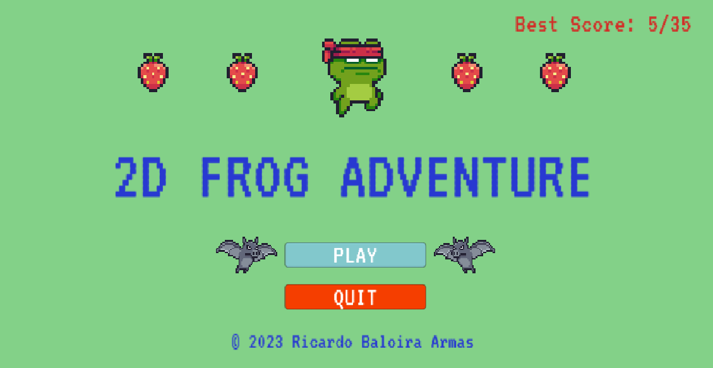
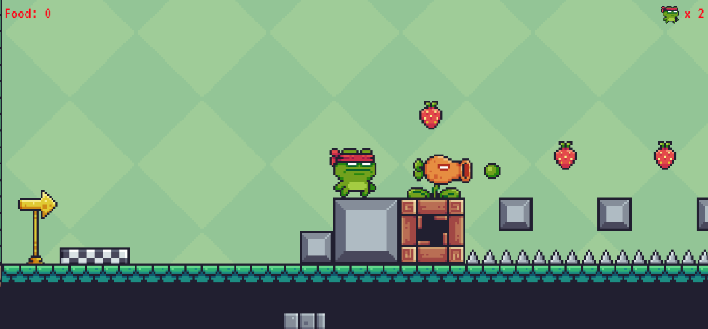
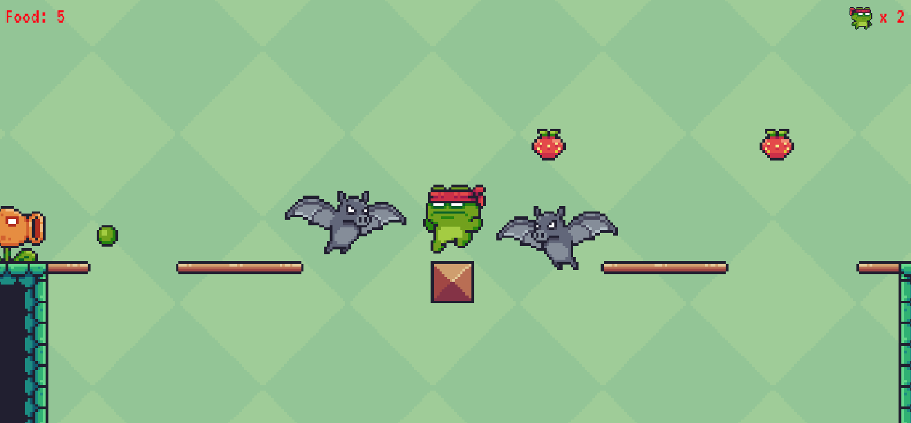
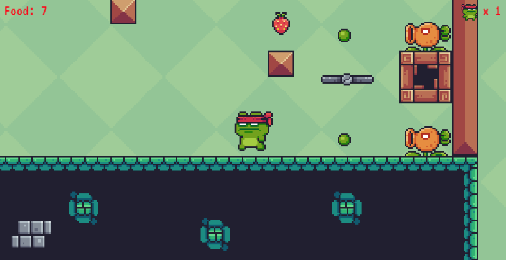
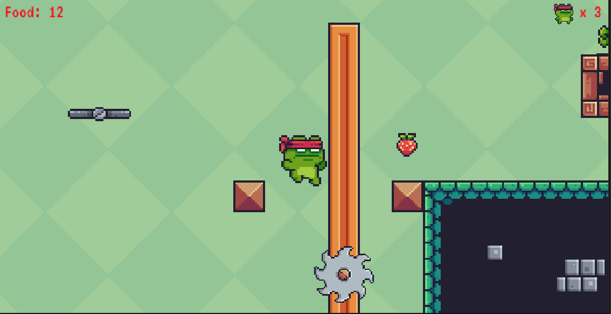
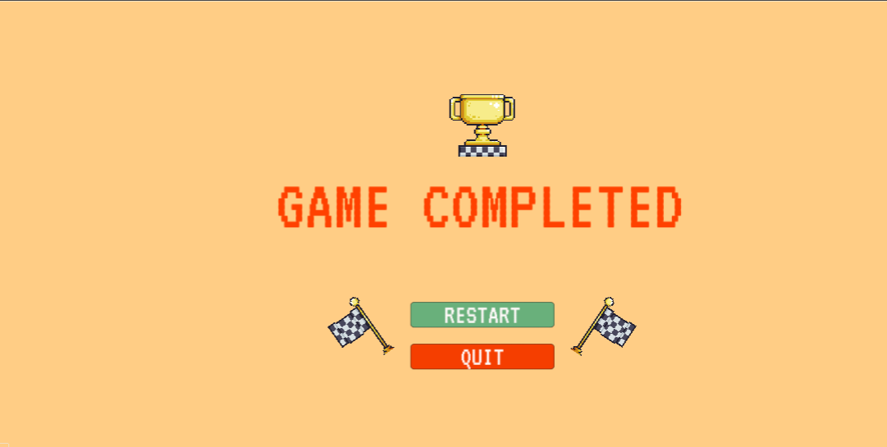

# 2D Frog Adventure

2D platform game created with Unity and C#. 
Guide the 🐸 through the forest collecting as many 🍓 as possible and avoiding many dangers.
 
 
Move the character with the arrow keys and jump with <kbd>Space</kbd>
 
 
Touch the 🏆 to complete the level!

---------------------------------------------

Juego de plataformas en 2D creado con Unity y C#.
Guía a la 🐸 a través del bosque recolectando tantas 🍓 como sea posible y evitando muchos peligros.
 
 
Mueve al personaje con las flechas del teclado y salta con <kbd>Space</kbd>
 
 
¡Toca el 🏆 para completar el nivel!

 

| [🎮 Preview](#preview) | [:camera: Screenshots](#screenshots) | [🔖 License](#license) |
| --------------- | -------- | ----------- |

 

## Preview

 

## Screenshots

 

## License
Copyright ©️ 2023 Ricardo Baloira Armas
